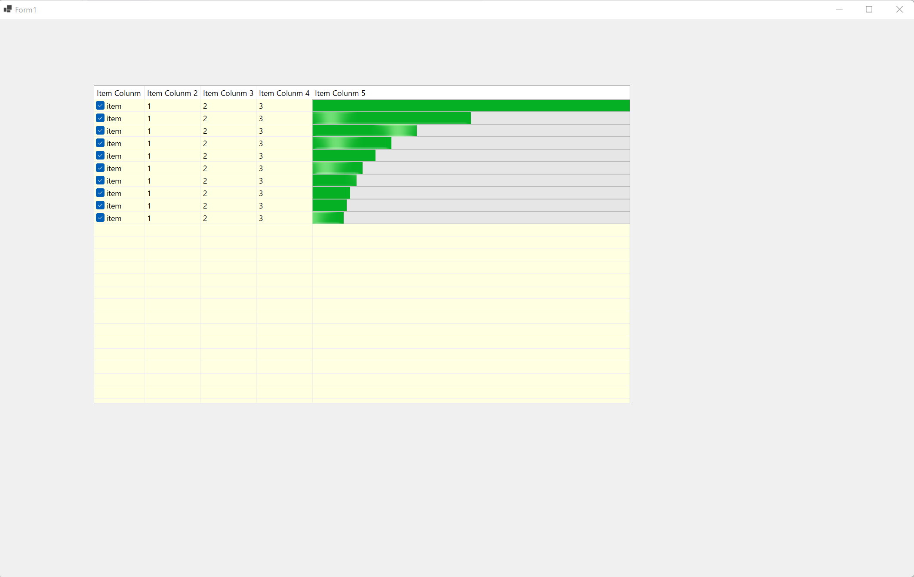

# ListView test by C#

## ポイント

### 初期化時

* `ListView` の `Controls` に `ProgressBar` を追加する。(子コントロールとして追加する)
* `ListViewItem.ListViewSubItem` の `Tag` に `ProgressBar` のインスタンスを関連付ける。

### ListView の親Form の `Load` ハンドラ

* `ListViewItem.ListViewSubItem` の `Tag` から `ProgressBar` のインスタンスを取り出す。
* `ListViewItem.ListViewSubItem` の `Bounds` を `ProgressBar` の `Bounds` に設定して、`ListViewItem.ListViewSubItem` いっぱいに`ProgressBar`を設定する。
